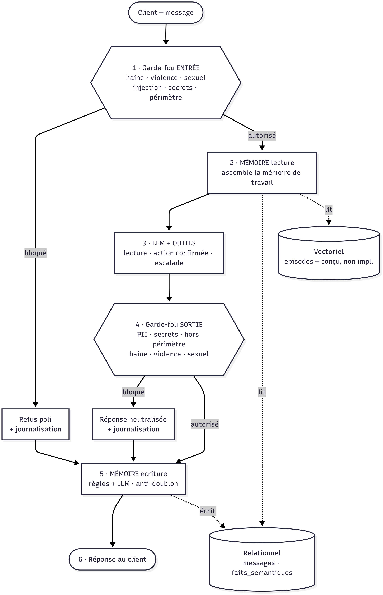
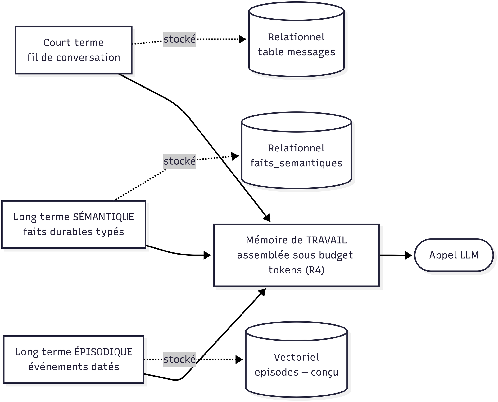
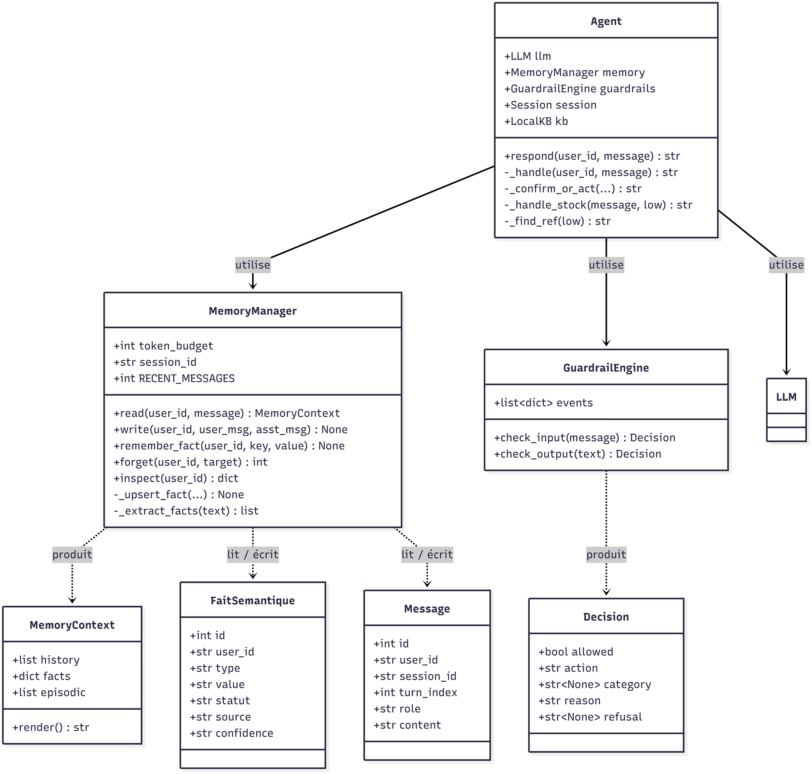
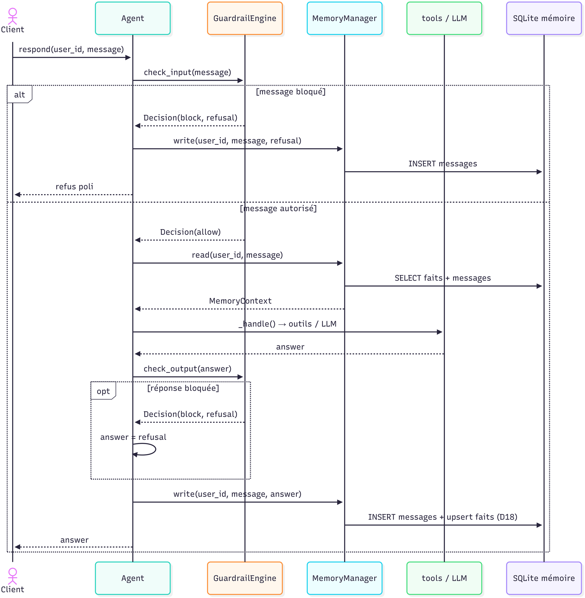
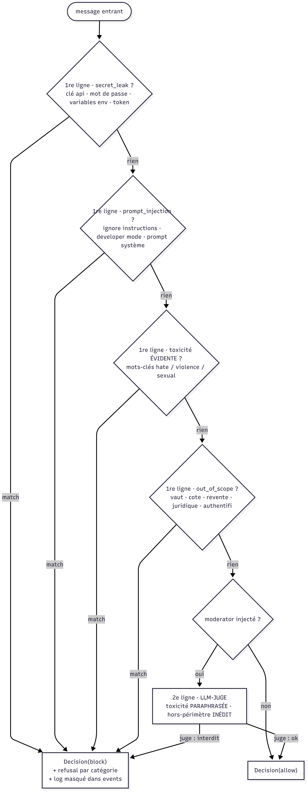
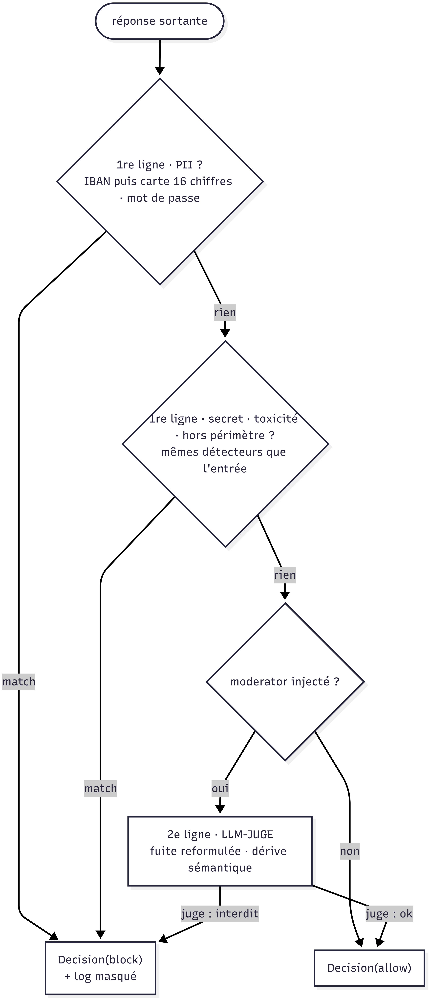
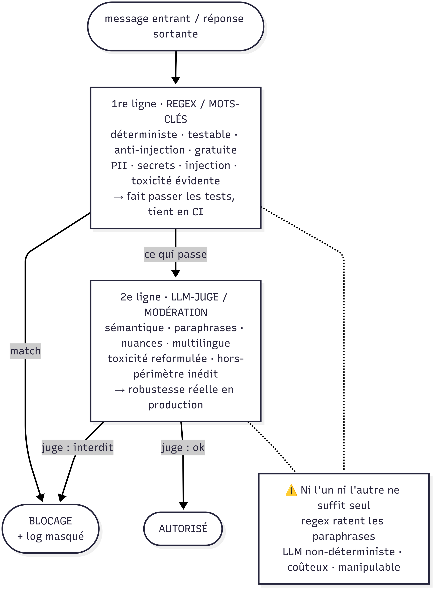

# Schémas d'architecture commentés — Velmo 2.0

> Dossier de conception : les sept schémas de l'architecture, chacun accompagné de sa lecture guidée,
> des décisions qu'il porte et des écarts code/conception assumés.
>
> **Auteur : Alpha** · juillet 2026

**Document complet :** [`Velmo-2.0_Schemas-architecture-commentes.docx`](Velmo-2.0_Schemas-architecture-commentes.docx)
— 26 pages, 7 figures. *(À la première ouverture dans Word, `F9` sur le sommaire pour le peupler.)*

Les schémas sont produits sous **Mermaid** : leurs sources sont du texte versionné, donc régénérables et
relisibles dans l'historique Git.

---

## Structure du document

Chaque schéma est présenté selon la même grille, en quatre temps :

| Section | Ce qu'elle répond |
| --- | --- |
| Ce que montre le schéma | À quelle question ce point de vue répond — et à quelles questions il ne répond volontairement pas. |
| Lecture guidée | Le parcours du schéma, chemin par chemin, dans l'ordre où il se lit. |
| Ce que le schéma décide | Les décisions de conception que le dessin fige, et l'argument qui les tient. |
| Limites et écarts | Ce qui est conçu mais non implémenté, ce qui reste à démontrer. |

---

## Les sept schémas

Les quatre premiers décrivent **ce que fait l'agent** ; les trois derniers, **ce qui l'empêche de mal faire**.

### 1. Architecture globale — le parcours d'un message

Les six étapes traversées par un message, de l'entrée à la réponse. Le LLM est enfermé au milieu : rien
n'entre sans passer le garde-fou d'entrée, rien ne sort sans passer celui de sortie.

### 2. Architecture mémoire

Les trois types de mémoire, leur substrat de stockage et leur convergence vers la mémoire de travail.
Le partage relationnel/vectoriel se décide sur le **motif d'accès**, pas sur l'étiquette du souvenir.

### 3. Diagramme de classes

Les trois classes centrales et les objets qu'elles produisent. `Decision` est un objet documenté, pas un
booléen : c'est ce qui rend la journalisation et l'audit possibles.

### 4. Séquence des interactions

Trace fidèle de `agent.respond()`. Un message bloqué ne coûte **aucun appel au modèle**, et le tour est
écrit en mémoire sur les deux branches — aucun trou dans l'historique.

### 5. Garde-fou d'entrée — `check_input`

Quatre détecteurs déterministes en cascade, puis le LLM-juge optionnel. Une seule porte de sortie
négative, donc un seul endroit où le refus est formulé et journalisé.

### 6. Garde-fou de sortie — `check_output`

Même structure, deux différences justifiées : `pii` n'existe qu'en sortie, `prompt_injection` qu'en entrée.
L'IBAN est testé **avant** la carte à 16 chiffres, sans quoi le blocage serait journalisé sous la mauvaise
catégorie.

### 7. Défense en profondeur — deux lignes, pas une hiérarchie

Le principe qui donne leur forme aux deux précédents. La 1re ligne (regex) bloque tôt le cas net et tient
en CI ; la 2e (LLM-juge) rattrape le cas subtil — mais comme elle est manipulable et non déterministe,
elle n'est jamais seule et jamais devant.

---

## Écarts assumés, signalés sur les schémas eux-mêmes

| Écart | Décision |
| --- | --- |
| `MemoryContext` lu mais non injecté dans le prompt LLM | Le chaînon existe, il reste à brancher. |
| Magasin vectoriel `episodes` conçu, non construit | Les cas de test ne l'exercent pas → priorité au sémantique relationnel, qui est mesuré. |
| LLM-juge absent du chemin testé en CI | Choix délibéré : le socle testé doit être déterministe. Le crochet `moderator` est prêt. |

Un schéma qui montrerait une architecture idéale que le code ne réalise pas serait un schéma qui ment.
